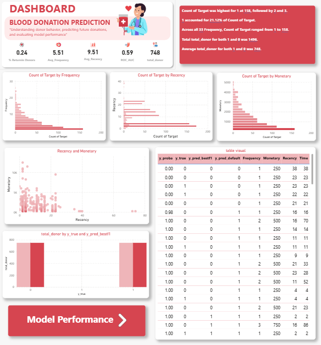
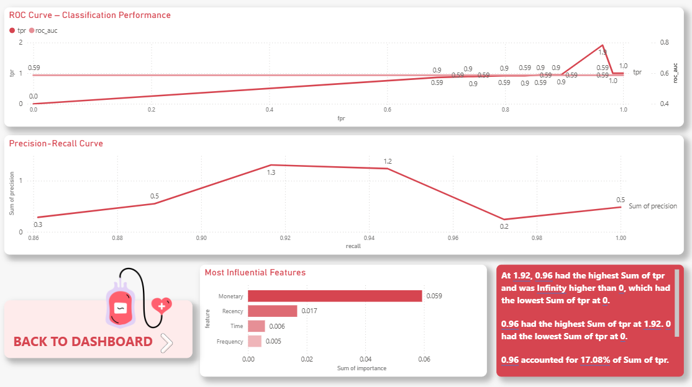
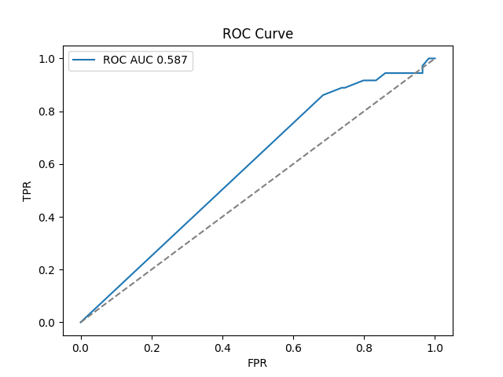
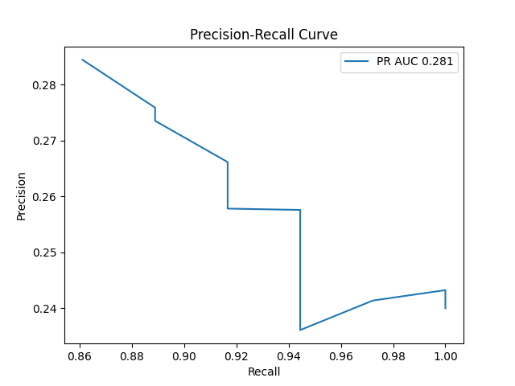
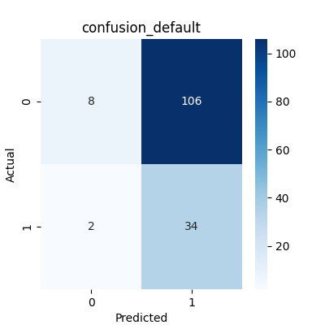
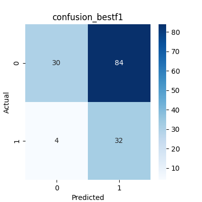

# blood-donation-prediction-ml
# 🩸 Blood Donation Prediction using Machine Learning

---

## 📌 Overview
This project presents an **end-to-end Machine Learning pipeline** for predicting whether a person is likely to donate blood. The solution integrates **data preprocessing, model training, evaluation, explainability, and dashboard visualization** to generate actionable healthcare insights.

---

## 🧠 Business Problem
Blood banks often face challenges in maintaining adequate blood supply due to unpredictable donor behavior.

### Key Challenges:
- ❌ Uncertain donor availability  
- ❌ Inefficient resource planning  
- ❌ Lack of targeted donor engagement  

👉 This project helps in **predicting potential donors** using historical data.

---

## 🎯 Objectives
- Analyze historical blood donation data  
- Identify key behavioral patterns  
- Build ML models for prediction  
- Evaluate model performance using advanced metrics  
- Develop interactive dashboard for insights  

---

## 🚀 Goals
- Improve donor prediction accuracy  
- Support data-driven healthcare decisions  
- Optimize blood supply planning  
- Enable targeted donor outreach strategies  

---

## 📊 Dataset

Due to large file size, the dataset is hosted on Google Drive.

🔗 Download Dataset:
- [Blood_Donation_Dataset](https://drive.google.com/drive/folders/1GYXZlKUEY9ahAI-OMcfWunEFvy6eBc2q?usp=drive_link)

📌 Note:
Download the dataset and place it inside the  folder before running the notebook.

---

## 📊 Dataset Overview

| Feature     | Description                          |
|------------|--------------------------------------|
| Recency    | Months since last donation           |
| Frequency  | Total number of donations            |
| Monetary   | Total blood donated                  |
| Time       | Months since first donation          |
| Target     | Donation outcome (0 = No, 1 = Yes)   |

---

## ⚙️ Machine Learning Workflow

### 🔹 Data Preprocessing
- Data cleaning and validation  
- Missing value analysis  
- Feature scaling (StandardScaler)  
- Dataset splitting (Train/Test)  

### 🔹 Model Development
- Logistic Regression (Baseline Model)  
- Random Forest Classifier  
- TPOT AutoML (Optimized Pipeline)  

### 🔹 Model Evaluation
- ROC Curve (AUC ≈ 0.587)  
- Precision-Recall Curve (PR AUC ≈ 0.281)  
- Confusion Matrix Analysis  
- Threshold Optimization (Best F1, Youden’s J)  

### 🔹 Explainability
- SHAP-based feature importance analysis  

### 🔹 Deployment & Integration
- Model saved using Joblib (`.pkl`)  
- Prediction pipeline for new data  
- SQL export for dashboard integration  

---

## 📉 Model Performance Summary

| Metric                  | Value      | Insight                                      |
|------------------------|-----------|----------------------------------------------|
| ROC AUC                | 0.587     | Slightly better than random                  |
| PR AUC                 | 0.281     | Poor performance on positive class           |
| Precision              | Low       | High false positives                         |
| Recall                 | Moderate  | Able to capture donors                       |
| Overall Performance    | Weak      | Needs optimization                           |

---

## 📊 Dashboard Preview

### 🔹 Main Dashboard

### 🔹 Model Performnce Dashboard

### 🔹 ROC Curve

### 🔹 Precision-Recall Curve

### 🔹 Confusion Default

### 🔹 Confusion bestf1

---

## 📒 VS Code
Includes:
- Exploratory Data Analysis (EDA)  
- Feature Engineering  
- Model Training & Evaluation  
- Visualization  

---

## 📁 Project Structure
blood-donation-prediction-ml/

│

├── notebooks/

│   └── blood_donation_analysis.py

│

├── src/

│   ├── cleaning.py

│   ├── evaluate_and_export.py

│   ├── explain.py

│   ├── export_to_sql.py

│   ├── save_model.py

│   ├── score.py

│   └── best_pipeline.py

│

├── models/

│   └── final_model.pkl

│

├── outputs/

│   ├── plots/

│   │   ├── roc_curve.png

│   │   ├── pr_curve.png

│   │   ├── confusion_default.png

│   │   ├── confusion_bestf1.png

│   │   ├── correlation_heatmap.png

│   │   ├── target_distribution.png

│   │

│   ├── roc_points.csv

│   ├── pr_points.csv

│   ├── tableau_predictions.csv

│   ├── tableau_metrics.csv

│   └── feature_importance.csv

│

├── dashboard/

│   └── blood_donation_dashboard.pbix

│

├── assets/

│   ├── dashboard_preview.png

│   ├── roc_curve.png

│   ├── pr_curve.png

│   ├── confusion_matrix.png

│   └── feature_importance.png

│

├── Blood_Donation_Prediction_report.pdf

├── requirements.txt

└──  README.md

---

## 🧰 Tech Stack

| Category        | Tools / Technologies                     |
|----------------|------------------------------------------|
| Programming    | Python                                   |
| ML Libraries   | Scikit-learn, TPOT, SHAP                 |
| Visualization  | Matplotlib, Seaborn, Power BI            |
| Database       | SQL / SQLite                             |
| Tools          | Jupyter Notebook, GitHub                 |

---

## 💡 Key Insights
- Recency and Frequency are strong predictors of donation behavior  
- Frequent and recent donors have higher donation probability  
- Model struggles with class imbalance  
- High false positives reduce prediction reliability  

---

## ⚠️ Limitations
- Class imbalance affects model performance  
- Limited dataset size  
- Low precision and high false positives  
- Model requires further tuning  

---

## 🔮 Future Scope
- Implement advanced models (XGBoost, Deep Learning)  
- Apply SMOTE for class imbalance handling  
- Deploy model as a web application  
- Real-time prediction system  
- Improve feature engineering  

---

## 👨‍💻 Author
**Pinkal Patel**  
🎓 B.Tech IT | 📊 Data Analytics & Machine Learning Enthusiast  

---
